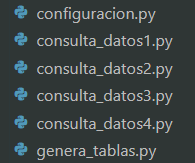
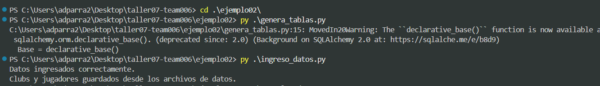
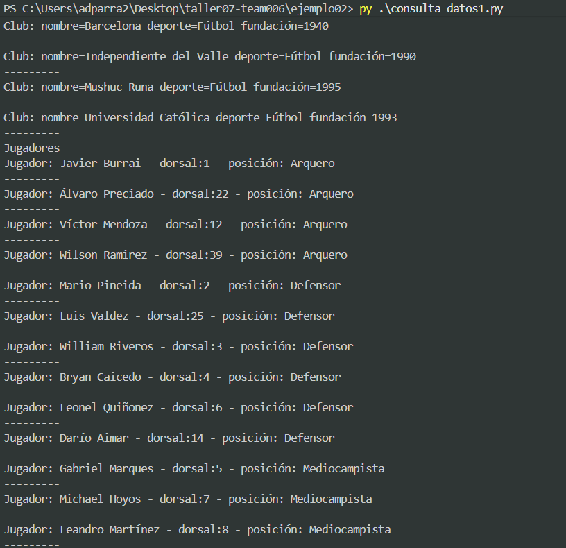
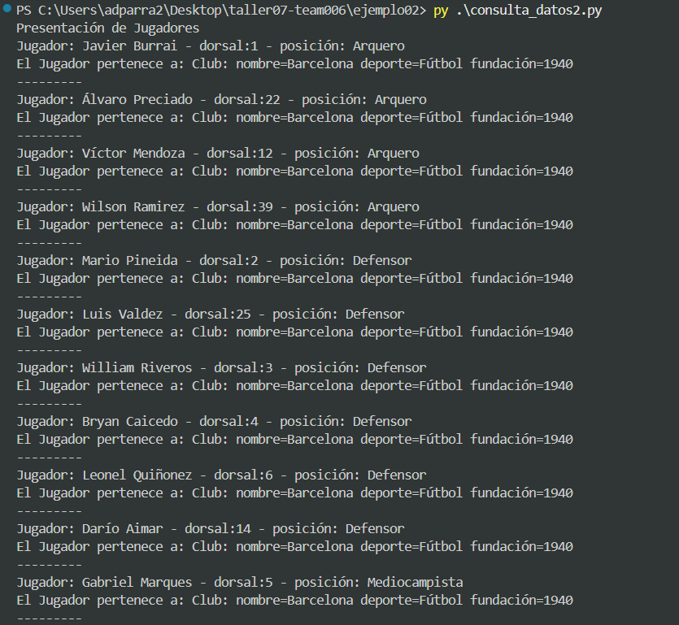
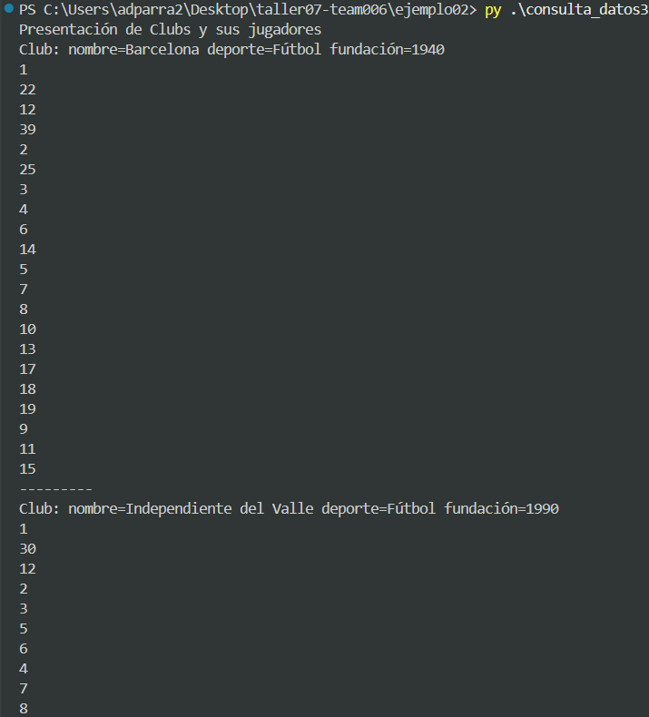
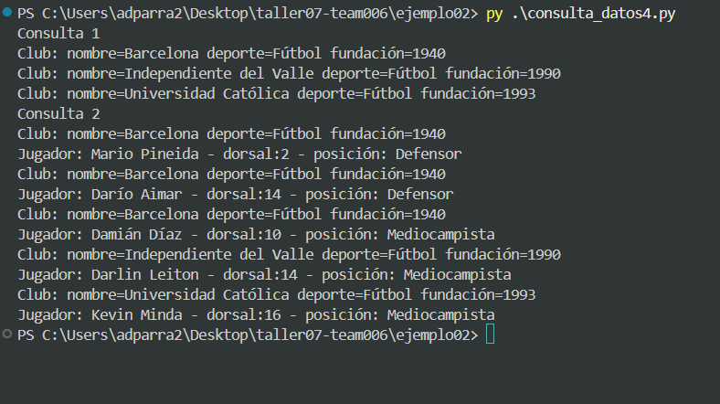

## Actividad

* Copiar en esta carpeta los siguientes archivos de la carpeta ejemplo01
	* configuracion.py
	* genera_tablas.py
	* consulta_datos1.py
	* consulta_datos2.py
	* consulta_datos3.py
	* consulta_datos4.py
* Crear un archivo llamado ingreso_datos.py que permita guardar información en las entidades Club y Jugador.
	* Los registros de la clase Club se deben obtener de la carpeta data y el archivo datos_clubs.txt.
	* Los registros de la clase Jugador se deben obtener de la carpeta data y el archivo datos_jugadores.txt.
	* La siguiente consulta, ejemplo, puede ayudar en algún proceso: 

	```python
	session.query(Club).filter_by(nombre="LDU").one()
	```

* Ejecutar los archivos en el orden especificado:
``` sh
python genera_tablas.py
python ingreso_datos.py
python consulta_datos1.py
python consulta_datos2.py
python consulta_datos3.py
python consulta_datos4.py
```
* Verificar que la información obtenida sea la correcta


# EJECUCION
## Actividades realizadas

### Organizacion de archivos 

Se copio y pego los archivos que debian hacerse 


### Creacion de ingreso de datos

Se creo el archivo ingreso de datos con el cual podemos guardar esta informacion de club y jugador 
De manera mas ordenada que en ejemplo01

### Capturas de ejecuciones locales


ejecucion de generacion de tablas e ingreso de datos 


ejecucion de consulta 1


ejecucion de consulta 2


ejecucion de consulta 3


ejecucion de consulta 4