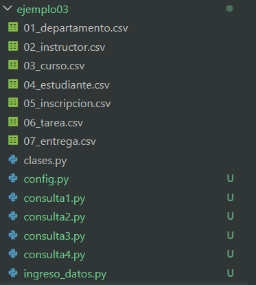
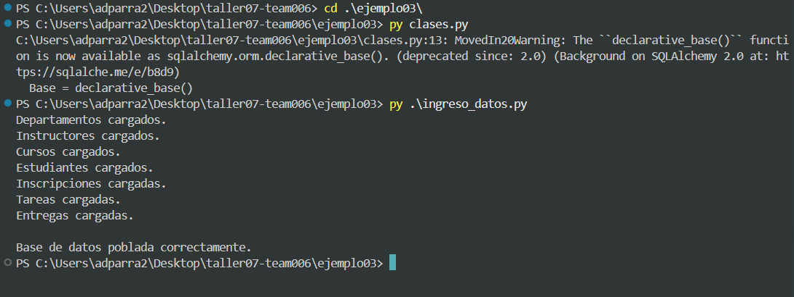
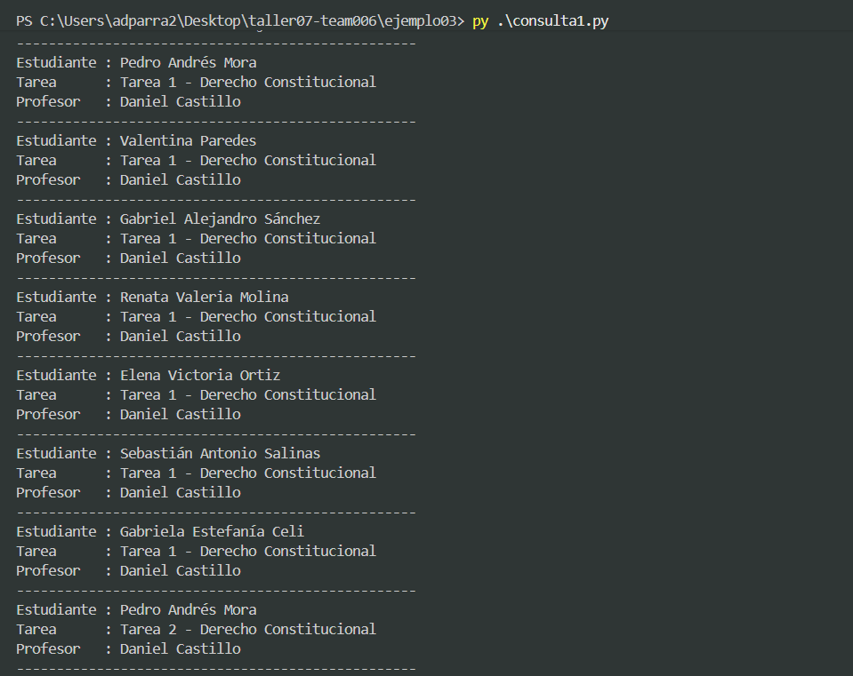
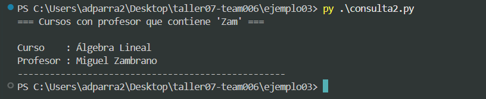
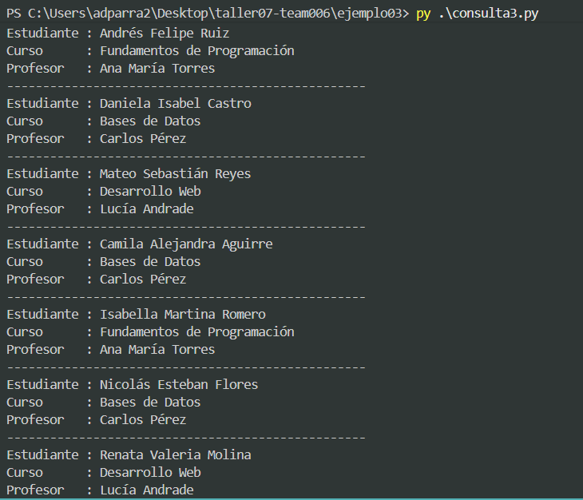
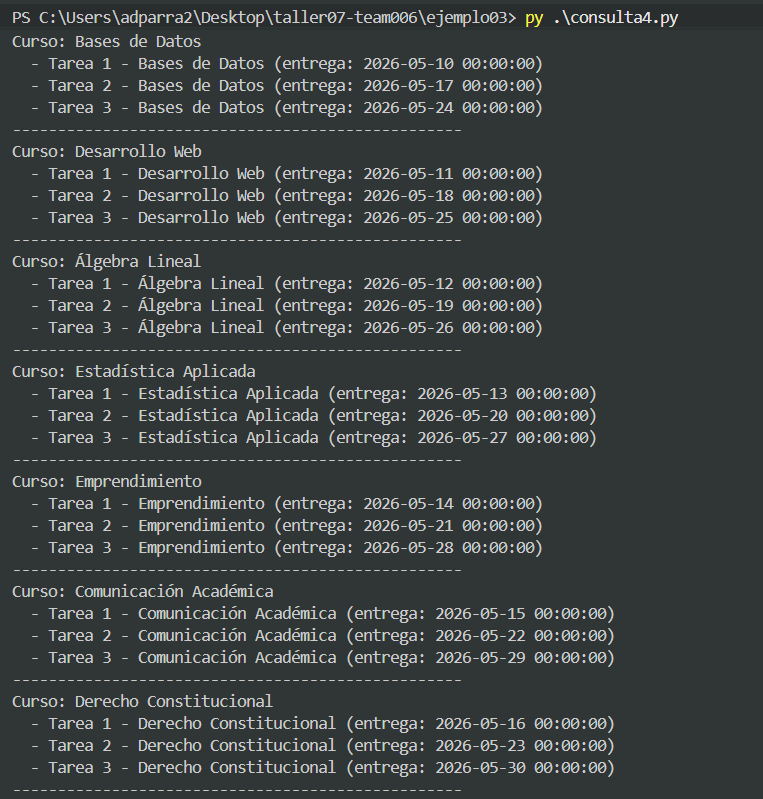

## Indicaciones

1. Crear las entidades en función de clases.py
2. Crear un archivo que permita poblar la base de datos; usar los csv's dados

Orden sugerido de carga:

- 01_departamento.csv
- 02_instructor.csv
- 03_curso.csv
- 04_estudiante.csv
- 05_inscripcion.csv
- 06_tarea.csv
- 07_entrega.csv

3. Generar los siguiente archivos

* consulta1.py: Listas las entregas, presentar por cada entrega: nombre del estudiantes, titulo, nombre del profesor
* consulta2.py: Listar los cursos, obtener los cursos profesores en su nombre tengan la cadena "Zam"
* consulta3.py: Listar las inscripciones del departamento de Ciencias de la Computación. Por cada inscripción, presentar el nombre del estudiante, el nombre del curso y el nombre del profesor
* consulta4.py: Por cada curso, presentar sus tareas asociadas.

# EJECUCIÓN - Ejemplo 03

## Actividades realizadas

Se trabajó con los archivos CSV proporcionados y el archivo `clases.py` ya existente.
La carpeta quedó organizada de la siguiente manera:

### Creación de `ingreso_datos.py`

Se creó el archivo `ingreso_datos.py` que lee los 7 archivos CSV en el orden correcto
y los carga en la base de datos respetando las relaciones entre tablas (llaves foráneas).

Tomamos en cuenta las dependencias para poder hacer una carga valida:
1. `01_departamento.csv` — sin dependencias
2. `02_instructor.csv` — sin dependencias
3. `03_curso.csv` — depende de Departamento e Instructor
4. `04_estudiante.csv` — sin dependencias
5. `05_inscripcion.csv` — depende de Estudiante y Curso
6. `06_tarea.csv` — depende de Curso
7. `07_entrega.csv` — depende de Tarea y Estudiante

Se usa `csv.DictReader` para leer cada archivo y se hace `commit` luego de cada
entidad para garantizar que los registros existan antes de cargar los que dependen de ellos.

### Creación de las consultas

#### `consulta1.py`
Lista todas las entregas. Por cada entrega muestra:
- Nombre del estudiante
- Título de la tarea
- Nombre del profesor

#### `consulta2.py`
Lista los cursos cuyos profesores tienen la cadena `"Zam"` en su nombre.
Se usa `.join(Instructor).filter(Instructor.nombre.like("%Zam%"))`.

#### `consulta3.py`
Lista las inscripciones del departamento **Ciencias de la Computación**.
Por cada inscripción muestra el nombre del estudiante, el nombre del curso y el nombre del profesor.
Se encadenan los joins: `Inscripcion → Curso → Departamento`.

#### `consulta4.py`
Por cada curso lista sus tareas asociadas, navegando la relación `curso.tareas`
definida en `clases.py`.

## Capturas de ejecuciones locales

### Creación de tablas e ingreso de datos

### Consulta 1 — Entregas con estudiante, tarea y profesor

### Consulta 2 — Cursos con profesor que contiene "Zam"

### Consulta 3 — Inscripciones de Ciencias de la Computación

### Consulta 4 — Tareas por curso

